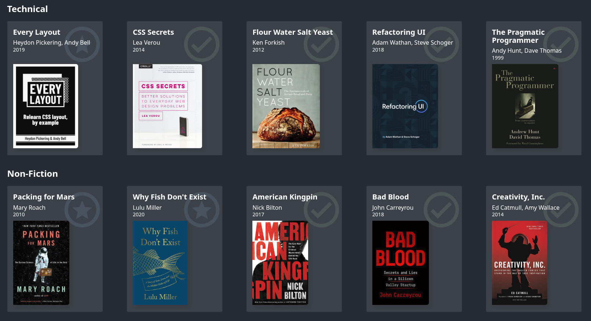

# Bookshelf

https://bookshelf.renatolacerda.com/

This is the source code for my personal project where I list and share books I've read, started, and recommend to others. The website features a user-friendly interface where you can browse through various book cards, each containing the book's title, author(s) name, year of first publishing, and an image of the cover.

## Tools

The website is built using Nuxt 4, a powerful Vue.js framework known for its performance and developer experience. For content management, I use Nuxt Content to handle data via YAML files, paired with Sveltia CMS to provide a user-friendly editing interface.

I use TypeScript and Zod to ensure type safety and validate the data schema. This combination provides robustness and reliability, ensuring that the book data structure remains consistent.

Using these tools, I was able to build a responsive and dynamic website that allows me to easily add new books, update existing ones, and showcase my book collection in an organized and visually appealing way.

## Deployment

The project is deployed on Firebase Hosting. A CI/CD pipeline is set up to automatically build and deploy the application whenever changes are pushed to the main branch.

## Credits

books (favicon) by Jakub Čaja from <a href="https://thenounproject.com/browse/icons/term/books/" target="_blank" title="books Icons">Noun Project</a>
